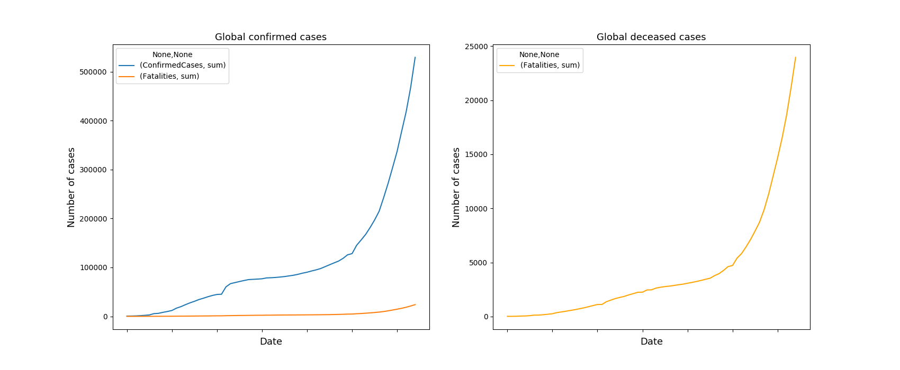
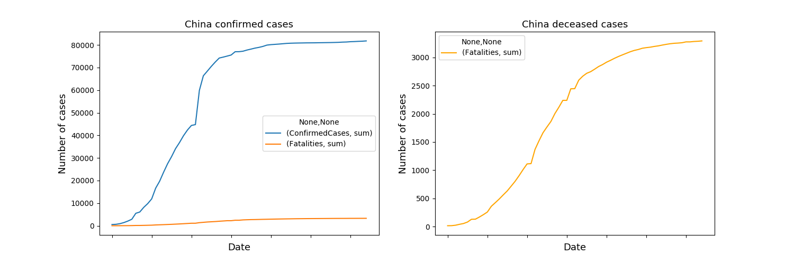
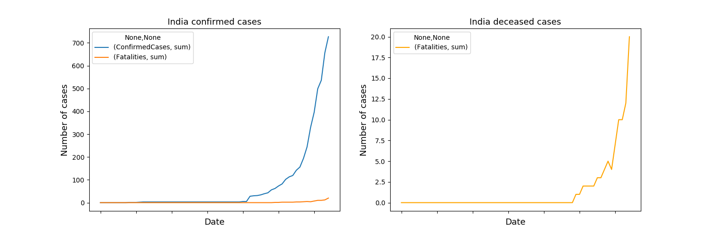
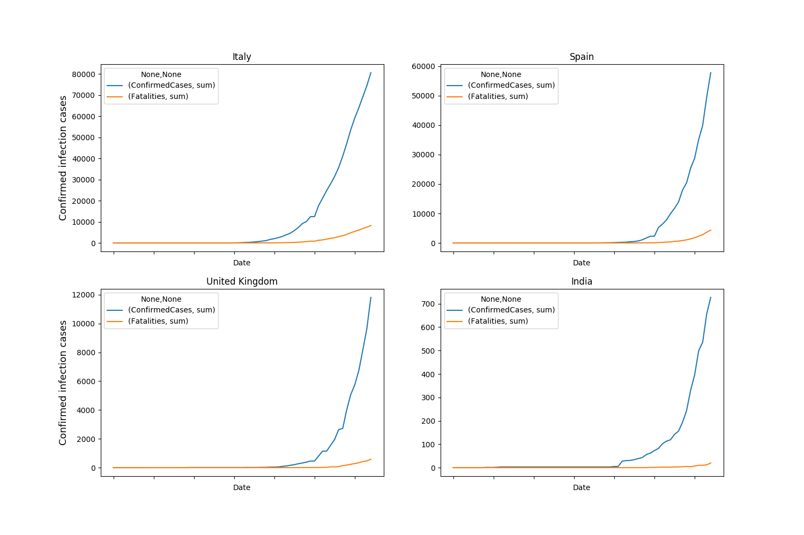
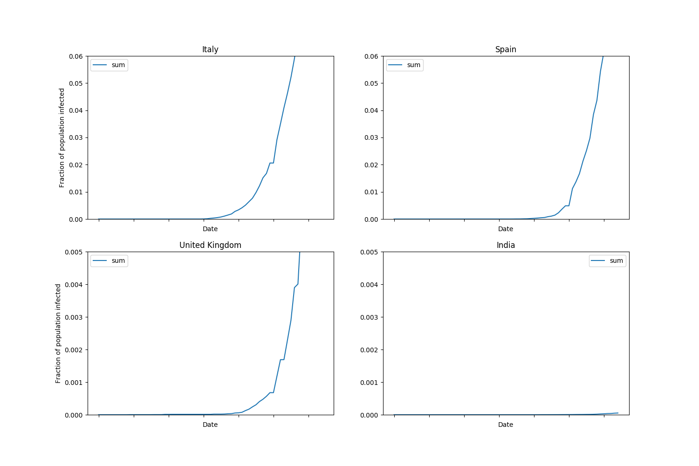
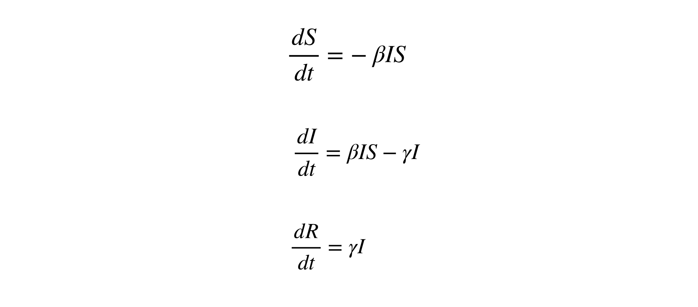
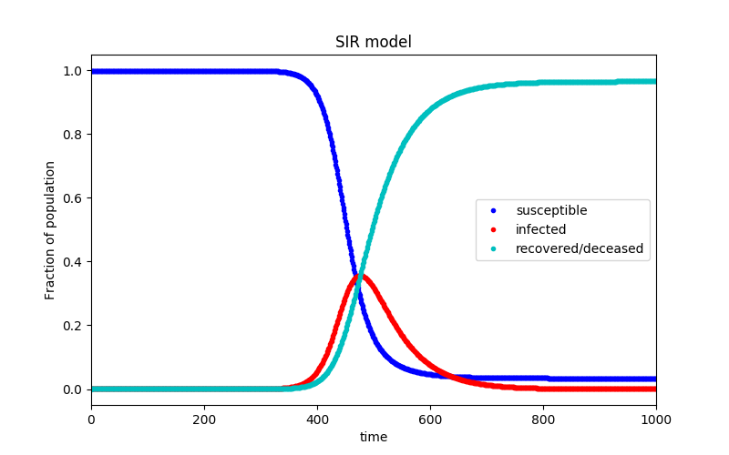
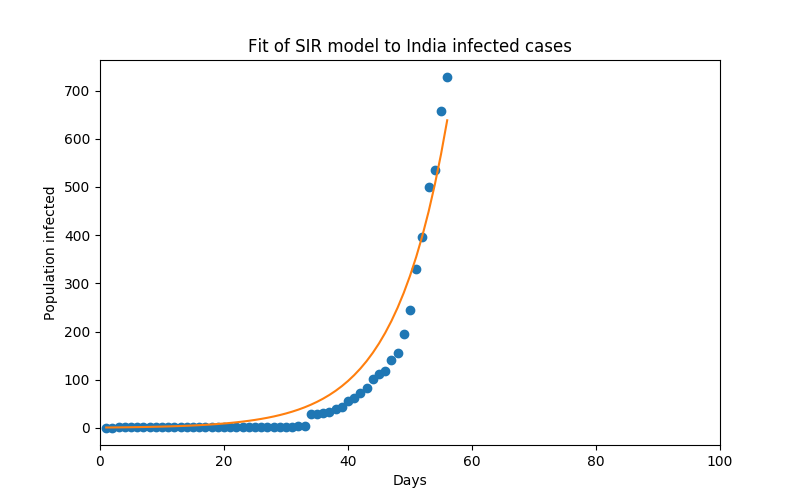
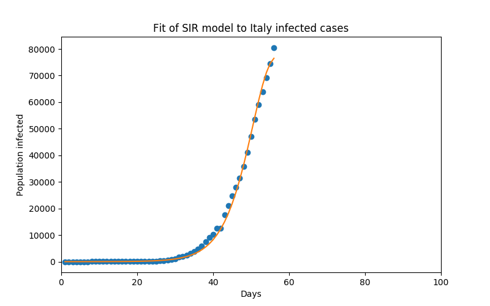

# COVID_MODELLING_IITR

## Team Members
1. Abdulahad Khan 17112002
2. Abhishek Kumar 17112005
3. Ayush Kumar 17112020
4. Shuvam Samadder 17112076

## Libraries
Make sure to import the following libraries in your machine to initiate.

```bash
import numpy as np 
import pandas as pd 
import matplotlib.pyplot as plt
import seaborn as sns
from sklearn import preprocessing
import time
from datetime import datetime
import warnings
warnings.filterwarnings('ignore')
import scipy as sp
import os
from scipy import integrate, optimize
```
## Basic Analysis Secttion

First of all, let's take a look at some elementary data analysis of our dataset.

### Global Trend

The following plot perfectly depicts the confirmed global confirmed and death trend in a time series manner.



### China Trend

China was the first country to be infected from the virus. Due to this they were not prepared for the virus even they failed to identify the virus until they had suffciently high number of confirmed cases. That's why initially china had a quite high mortality rate initially but due to some strict contanment meeasures they were succesful to contain the spread of the virus inside their country.



### India Trend

As per a estimate China had it's first case in December 2019 but India got it's first case pretty late i.e. around 31st January 2020. The following plot depicts the Daywise case analysis in Indian context.



### Italy, Spain, UK and India

Italy and Spain are the most affected countries in the Europian Union. Athough UK was a integral part of Europian union before the Brexit but after that the connectivity between Europe and UK became weak which helped to mitigate the initial import related spread of corona virus in UK from the rest of the Europian Union countries.



### Fractional Population Trend

Following plot depicts fractional population infected with time for Italy, Spain, UK and India. The fractional infected plot for India is significantly flat as the population of India is huge compared to the other countries and the total infected case in India was lower at the time of plotting.



## SIR Model (Suspected-Infected-Recovered Model)
As our main objective is to do a predictive modelling we are using SIR model, which is by far the best for epidemiological modelling. In this case we plot three seperate graphs of suspected, infected and recovered cases with time. Following are the three fundamental differential equation is used for the modelling.



Source: [SIR Equations](https://www.lewuathe.com/) 

Where β is the contagion rate of the pathogen and γ is the recovery rate.

In our calculation we have used 4th order Runge Kutta method to solve our system of differnential equations.   

Assuming world populstion as 7.8 Billion we have created the following normalized SIR Plot. The assumed value of modeled parameter are following 

- β = 0.7
- γ = 0.2



Our next job is to find out the optimal value of β and γ by fitting the data of India for with the global SIR plot. 

The fitted SIR plot for India and Italy are as following

1. **India**



2. **Italy**



**NOTE:** As the data for India is very less so it's not as prominant as Italy hence the data point is less. 

## Machine Learning Prediction Model 


